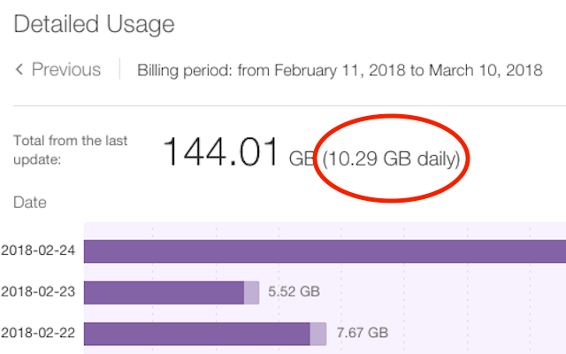

# Enhancements to TELUS Quebec website (unofficial)

## Chrome extension

This extension enriches user experience on the website of an ISP from Quebec (TELUS). This extension is not approved by TELUS.

### Features

* Displays average daily usage next to the total monthly usage in the detailed usage chart.

## Credits

* This code is [MIT licensed](LICENSE) open source.
* Icon from [EmojiOne](http://emojione.com/), licensed CC-BY 4.0.
