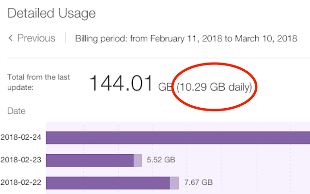

# Mod TELUS Quebec (unofficial)

[Mod TELUS Quebec (unofficial)](https://mtq.chrif.org/) is a Chrome extension for enriching user experience on the 
website of an ISP from Quebec (TELUS). This extension is not authorized by TELUS.

## Installation

You can [install the extension at the Chrome Web Store](https://chrome.google.com/webstore/detail/enhancements-to-telus-que/oiejeoehnnnpcemldokikbgacnhlhfhp).

## Features

* Displays average daily usage next to the total monthly usage in the detailed usage chart. This allows to know if 
you are on target to not exceed your bandwidth usage for the current month.

	

## Issues

* Please report issues and suggestions [here](https://github.com/chrif/chrome-telusquebec/issues).

## Credits

* This code is [MIT licensed](LICENSE) open source.
* Icon from [EmojiOne](http://emojione.com/), licensed CC-BY 4.0.
* Project directory structure inspired by [https://github.com/gilmoreorless/convert-airport-codes](https://github.com/gilmoreorless/convert-airport-codes)
* Web template by [https://github.com/BlackrockDigital/startbootstrap-new-age](https://github.com/BlackrockDigital/startbootstrap-new-age)
